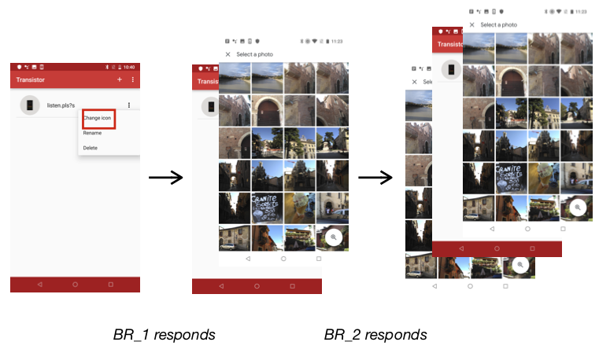

## Anchor: Android app crash Locator

### General Introduction

### Motivating Example 
#### Paradox in Fan et al's fix:

After step 3, since the onReceive() callback of both the normal BroadcastReceiver and the leaked object BroadcastReceiver would respond to the SELECT_IMAGE event. Puting a null-checker will prevent the leaked BroadcastReceiver from invoking startActivityForResult(), and allow the normal BroadcastReceiver to execute startActivityForResult(). Therefore the fix would work.

#### Regression caused by Developer’s Fix ec0b92.

              
After step 3, since the onReceive() callback of both the normal BroadcastReceiver and the leaked object BroadcastReceiver would respond to the eventBroadcastReceivers invoke startActivityForResult(), causing two ImageSelectActivity to be opened. Clicking on back button twice will direct the user to the ImageSelectActivity opened earlier. And causing much confusion to the developer.

### Phase 1

### Phase 2

### Link to dataset

